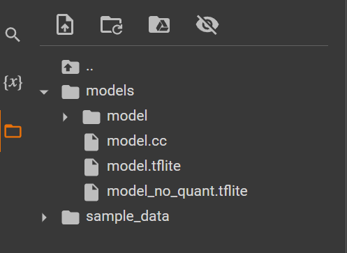

# **Sinewave Multi Dimension Binery Classification**

This example is designed to demonstrate the absolute basics of using [TensorFlow
Lite for Microcontrollers](https://www.tensorflow.org/lite/microcontrollers).
It includes the full end-to-end workflow of training a model, converting it for
use with TensorFlow Lite for Microcontrollers for running inference on a
microcontroller.

Additionally, this example takes two inputs and produces a single output, which is common for binary classification problems where the objective is to predict between two classes.

## **Training your Model**
To begin, you can access this [Colab](https://colab.research.google.com/drive/1Wg51JhFeeAvPsKzNXYO43IkWTwhxY8TI?usp=sharing) notebook to train your model.

## **Download your Model**
On the left-hand side of `Colab`, click on the file and download `model.cc`

## **Deploy the model to Microcontroller**
First, change the file extension of `model.cc` to `.cpp`, and then replace the existing `model.cpp` file. After that, include `model.h` by adding `#include "model.h`" in the code. Finally, you can upload the program to the microcontroller.

## **Output**
The output like this:

## **AllOpsResolver and MicroMutableOpResolver**
Creating a deep neural network on the microcontroller requires knowledge of using `AllOpsResolver` and `MicroMutableOpResolver`. While using `MicroMutableOpResolver` necessitates manually creating a deep neural network on the microcontroller, the advantage is that it consumes less memory. It is highly recommended to build the neural network on the microcontroller by continuously comparing it to the neural network trained in Python. You can find the AllOpsResolver source code in [AllOpsResolver](../../../src/tensorflow/lite/micro/all_ops_resolver.cpp).
